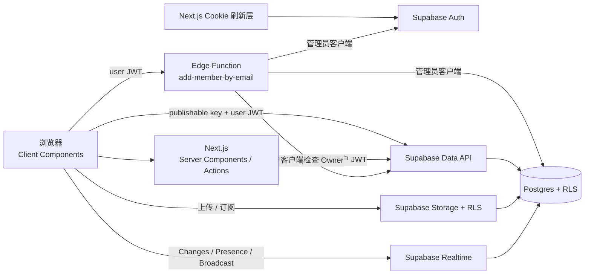

# SupaBoard 技术设计文档

| 项目 | 内容 |
| --- | --- |
| 文档版本 | 1.0 |
| 对应产品文档 | `docs/PRD.md` |
| 架构状态 | 可实施 |
| 开发模式 | 本地优先，最终连接 Supabase 托管项目验证 |

## 1. 设计目标

本项目刻意不引入 ORM 或单独的 Node.js API 层。Next.js 在可信服务端场景使用 Server Supabase Client，在需要实时连接和文件直传的场景使用 Browser Supabase Client；访问控制统一落在 Postgres RLS、Storage RLS 和 Realtime Authorization。

设计原则：

1. **数据库是安全边界**：隐藏按钮不是权限控制，任何客户端都必须受到相同策略约束。
2. **普通访问保持用户上下文**：Server Action 仍携带当前用户 Cookie，让 RLS 正常执行。
3. **特权访问最小化**：管理员客户端只存在于 `add-member-by-email` Edge Function，且只用于查找 Auth 用户和添加成员。
4. **迁移是唯一 schema 来源**：表、函数、触发器、策略、Storage 桶和 Realtime publication 全部通过迁移管理。
5. **前端保持薄层**：复杂一致性、约束与授权在数据库完成；前端负责输入、展示和即时反馈。

## 2. 官方基线与版本策略

实施开始时先检查 [Supabase Changelog](https://supabase.com/changelog)，重点搜索 Auth、API Keys、SSR、Realtime Authorization、Edge Functions 和 CLI 的 breaking change。

技术栈：

- Node.js 20 或更高版本。
- pnpm 与提交到 Git 的 `pnpm-lock.yaml`。
- 实施时稳定版 Next.js App Router、React 和 TypeScript。
- 固定版本的 `@supabase/supabase-js`、`@supabase/ssr` 和 `supabase` CLI。
- Zod：表单和 Edge Function 请求校验。
- Vitest：应用逻辑测试。
- Playwright：浏览器主流程和 Realtime 测试。
- pgTAP：数据库、RLS、Storage 和 Realtime policy 测试。

`@supabase/ssr` 的 API 仍可能变化，因此客户端工厂必须集中在 `src/lib/supabase`，不在业务组件中重复 Cookie 处理逻辑。

参考文档：

- [Next.js + Supabase](https://supabase.com/nextjs)
- [Row Level Security](https://supabase.com/docs/guides/database/postgres/row-level-security)
- [Storage Access Control](https://supabase.com/docs/guides/storage/security/access-control)
- [Realtime Authorization](https://supabase.com/docs/guides/realtime/authorization)
- [Securing Edge Functions](https://supabase.com/docs/guides/functions/auth)
- [Generating TypeScript Types](https://supabase.com/docs/guides/api/rest/generating-types)

## 3. 总体架构



### 3.1 访问路径

| 场景 | 执行位置 | 凭据 | 是否绕过 RLS |
| --- | --- | --- | --- |
| SSR 首屏读取 | Server Component | 用户 Cookie/JWT + publishable key | 否 |
| 表单写操作 | Server Action | 用户 Cookie/JWT + publishable key | 否 |
| Realtime | Browser Client | 用户 JWT | 否 |
| 头像和附件上传 | Browser Client | 用户 JWT | 否 |
| 附件签名 URL | Server Action | 用户 Cookie/JWT | 否 |
| 添加成员权限检查 | Edge Function 用户客户端 | 调用者 JWT | 否 |
| 按邮箱查 Auth 用户 | Edge Function 管理员客户端 | secret key | 是 |

## 4. 目录结构

```text
supabase-learn/
├── docs/
│   ├── PRD.md
│   └── TECH.md
├── src/
│   ├── app/
│   │   ├── (auth)/
│   │   │   ├── login/page.tsx
│   │   │   ├── signup/page.tsx
│   │   │   ├── forgot-password/page.tsx
│   │   │   └── update-password/page.tsx
│   │   ├── auth/callback/route.ts
│   │   └── app/
│   │       ├── layout.tsx
│   │       ├── page.tsx
│   │       ├── settings/page.tsx
│   │       └── workspaces/[workspaceId]/page.tsx
│   ├── features/
│   │   ├── auth/
│   │   ├── profiles/
│   │   ├── workspaces/
│   │   ├── tasks/
│   │   ├── comments/
│   │   ├── storage/
│   │   └── realtime/
│   ├── lib/
│   │   ├── supabase/client.ts
│   │   ├── supabase/server.ts
│   │   ├── actions/result.ts
│   │   └── validation/
│   ├── proxy.ts
│   └── types/database.ts
├── supabase/
│   ├── config.toml
│   ├── migrations/
│   ├── seed.sql
│   ├── functions/add-member-by-email/
│   │   ├── index.ts
│   │   ├── handler.ts
│   │   └── schema.ts
│   └── tests/database/
└── tests/
    ├── unit/
    └── e2e/
```

`features` 按业务能力组织查询、Server Action 和组件；`lib/supabase` 只负责创建客户端；生成文件 `database.ts` 不手工编辑。

## 5. 环境与本地开发

### 5.1 环境变量

Next.js `.env.local`：

```dotenv
NEXT_PUBLIC_SUPABASE_URL=http://127.0.0.1:54321
NEXT_PUBLIC_SUPABASE_PUBLISHABLE_KEY=本地 CLI 输出的 publishable key
```

规则：

- `.env*` 不提交，只提交 `.env.example` 的变量名。
- 任何 `NEXT_PUBLIC_` 变量都会进入浏览器包，因此只能放项目 URL 和 publishable key。
- 不在 Next.js 环境保存 secret/service key。
- Edge Function 使用平台提供的 Supabase 环境变量和受保护的 secret keys；本地额外秘密通过 `supabase functions serve --env-file` 注入。

### 5.2 标准工作流

```bash
pnpm exec supabase --help
pnpm exec supabase start
pnpm exec supabase migration new initial_schema
pnpm exec supabase db reset
pnpm exec supabase gen types typescript --local > src/types/database.ts
pnpm exec supabase test db
```

CLI 命令和参数在执行前通过对应的 `--help` 确认，不凭记忆猜测。新迁移始终通过 `supabase migration new` 创建文件名。

开发服务器支持通过 `localhost:3000` 或 `127.0.0.1:3000` 访问。非生产环境使用 `http://localhost:3000` 作为 Next.js `assetPrefix`，并允许 `127.0.0.1` 开发来源，避免本机 HTTP 代理拦截 Turbopack HMR WebSocket；生产构建不设置该前缀。

## 6. 数据模型

所有业务表位于 `public` schema，使用 `timestamptz` 和数据库生成的 UUID。所有暴露表显式授予所需角色访问权限并启用 RLS；Data API 的 schema exposure 与 RLS 是两层独立配置。

### 6.1 `profiles`

| 字段 | 类型 | 约束 |
| --- | --- | --- |
| `id` | `uuid` | PK，FK → `auth.users(id)`，`on delete cascade` |
| `display_name` | `text` | 非空，trim 后 1～80 字符 |
| `avatar_path` | `text` | 可空 |
| `created_at` | `timestamptz` | 非空，默认 `now()` |
| `updated_at` | `timestamptz` | 非空，默认 `now()` |

不在该表保存公开邮箱，避免成员列表泄露登录标识。

### 6.2 `workspaces`

| 字段 | 类型 | 约束 |
| --- | --- | --- |
| `id` | `uuid` | PK，默认 `gen_random_uuid()` |
| `name` | `text` | 非空，trim 后 1～100 字符 |
| `owner_id` | `uuid` | 非空，FK → `profiles(id)`，`on delete restrict` |
| `created_at` | `timestamptz` | 非空，默认 `now()` |
| `updated_at` | `timestamptz` | 非空，默认 `now()` |

### 6.3 `workspace_members`

| 字段 | 类型 | 约束 |
| --- | --- | --- |
| `workspace_id` | `uuid` | FK → `workspaces(id)`，`on delete cascade` |
| `user_id` | `uuid` | FK → `profiles(id)`，`on delete cascade` |
| `role` | `text` | `owner` 或 `member` |
| `added_by` | `uuid` | 可空，FK → `profiles(id)`，`on delete set null` |
| `joined_at` | `timestamptz` | 非空，默认 `now()` |

主键为 `(workspace_id, user_id)`。部分唯一索引保证每个工作区只有一条 `role = 'owner'` 记录；触发器阻止 Owner 成员关系被普通 DELETE/UPDATE 移除，并确保 `workspaces.owner_id` 与 Owner 成员一致。

### 6.4 `tasks`

| 字段 | 类型 | 约束 |
| --- | --- | --- |
| `id` | `uuid` | PK，默认 `gen_random_uuid()` |
| `workspace_id` | `uuid` | 非空，FK → `workspaces(id)`，`on delete cascade` |
| `title` | `text` | 非空，trim 后 1～200 字符 |
| `description` | `text` | 可空，最大 5000 字符 |
| `status` | `text` | `todo`、`in_progress`、`done`，默认 `todo` |
| `priority` | `text` | `low`、`medium`、`high`，默认 `medium` |
| `assignee_id` | `uuid` | 可空，FK → `profiles(id)`，`on delete set null` |
| `created_by` | `uuid` | 非空，FK → `profiles(id)`，`on delete restrict` |
| `created_at` | `timestamptz` | 非空，默认 `now()` |
| `updated_at` | `timestamptz` | 非空，默认 `now()` |

为 `(id, workspace_id)` 建立唯一约束，供评论和附件建立同工作区复合外键。任务写入触发器检查 `assignee_id` 是该工作区成员。

### 6.5 `comments`

| 字段 | 类型 | 约束 |
| --- | --- | --- |
| `id` | `uuid` | PK，默认 `gen_random_uuid()` |
| `task_id` | `uuid` | 与 `workspace_id` 组成复合 FK → `tasks`，`on delete cascade` |
| `workspace_id` | `uuid` | 非空，用于 RLS 和 Realtime 过滤 |
| `author_id` | `uuid` | 非空，FK → `profiles(id)`，`on delete restrict` |
| `body` | `text` | 非空，trim 后 1～2000 字符 |
| `created_at` | `timestamptz` | 非空，默认 `now()` |
| `updated_at` | `timestamptz` | 非空，默认 `now()` |

### 6.6 `attachments`

| 字段 | 类型 | 约束 |
| --- | --- | --- |
| `id` | `uuid` | PK，默认 `gen_random_uuid()` |
| `task_id` | `uuid` | 与 `workspace_id` 组成复合 FK → `tasks`，`on delete cascade` |
| `workspace_id` | `uuid` | 非空 |
| `uploader_id` | `uuid` | 非空，FK → `profiles(id)`，`on delete restrict` |
| `bucket_id` | `text` | 非空，固定为 `attachments` |
| `object_path` | `text` | 非空且唯一 |
| `file_name` | `text` | 非空，保存展示名称 |
| `content_type` | `text` | 非空 |
| `size_bytes` | `bigint` | 非空，1～10485760 |
| `created_at` | `timestamptz` | 非空，默认 `now()` |

上传流程是“先上传对象，再写元数据”；元数据写入失败时客户端立即删除刚上传对象。删除任务由 `delete-task` Edge Function 完整编排：用户客户端先证明调用者可删除任务，管理员客户端只清理附件对象，成功后用户客户端再删除任务记录。定期垃圾回收不在本 Demo 范围。

### 6.7 `activity_logs`

| 字段 | 类型 | 约束 |
| --- | --- | --- |
| `id` | `bigint generated always as identity` | PK |
| `workspace_id` | `uuid` | 非空，FK → `workspaces(id)`，`on delete cascade` |
| `actor_id` | `uuid` | 可空，FK → `profiles(id)`，`on delete set null` |
| `action` | `text` | `task.created`、`task.status_changed`、`task.deleted` |
| `entity_type` | `text` | 固定为 `task` |
| `entity_id` | `uuid` | 被操作任务 ID，不设 FK 以保留删除日志 |
| `metadata` | `jsonb` | 非空，默认 `{}` |
| `created_at` | `timestamptz` | 非空，默认 `now()` |

客户端对该表只有 SELECT 权限；写入由私有 trigger function 完成。

### 6.8 索引

- `workspace_members(user_id, workspace_id)`：用户工作区列表和成员判断。
- `tasks(workspace_id, updated_at desc)`：默认列表。
- `tasks(workspace_id, status, updated_at desc)`：状态筛选。
- `tasks(workspace_id, assignee_id, updated_at desc)`：负责人筛选。
- `comments(task_id, created_at)`：评论时间线。
- `attachments(task_id, created_at)`：任务附件。
- `activity_logs(workspace_id, created_at desc)`：活动时间线。
- RLS predicate 使用的外键列均建立索引。

## 7. Database Functions、视图与触发器

### 7.1 权限辅助函数

为避免 `workspaces` 与 `workspace_members` policy 之间递归，建立：

- `private.is_workspace_member(target_workspace_id uuid) returns boolean`
- `private.is_workspace_owner(target_workspace_id uuid) returns boolean`

二者使用 `SECURITY DEFINER` 只读查询成员表，固定空 `search_path`、所有对象使用全限定名，并在函数内要求 `auth.uid()` 非空。创建后先 `REVOKE EXECUTE ... FROM PUBLIC`，再只向 `authenticated` 授予执行权限。

这是本项目中少数必要的 definer 函数；它们不接受用户 ID、不返回成员数据、不能写表，并必须经过 database advisors 检查。

### 7.2 `create_workspace(name text)`

- `SECURITY INVOKER`，只允许 `authenticated` 执行。
- 校验 `auth.uid()` 和名称长度。
- 单事务插入 `workspaces` 和对应 `workspace_members(role = 'owner')`。
- 返回新建 `workspace_id`。
- 不接受客户端传入的 Owner ID。

### 7.3 `get_workspace_stats(target_workspace_id uuid)`

- `SECURITY INVOKER`，只允许 `authenticated` 执行。
- 非成员由 RLS/显式成员检查拒绝。
- 返回 `total`、`todo`、`in_progress`、`done` 四个整数。

### 7.4 `workspace_task_stats` 视图

- 使用 `WITH (security_invoker = true)`。
- 按工作区聚合任务状态。
- 只向 `authenticated` 授予 SELECT，底层 `tasks` RLS 继续生效。

### 7.5 Auth profile 触发器

- `auth.users` INSERT 后调用 `private.handle_new_user()`。
- 该函数需要 `SECURITY DEFINER`，固定 `search_path` 并撤销 PUBLIC 执行权限。
- 昵称只用于展示，不参与授权；授权不读取 `raw_user_meta_data`。

### 7.6 Activity 触发器

- `tasks` INSERT、UPDATE、DELETE 后调用 `private.log_task_activity()`。
- UPDATE 仅在 `status` 变化时写日志。
- 触发器使用 `auth.uid()` 记录 actor；系统操作允许 actor 为空。
- 函数位于非暴露 `private` schema，固定 `search_path` 并撤销 PUBLIC 执行权限。

## 8. RLS 与数据库授权

所有 policy 使用 `TO authenticated`，并结合成员或所有权谓词；仅写 `TO authenticated` 不构成业务授权。UPDATE 同时包含 SELECT policy、`USING` 和 `WITH CHECK`。

| 表 | SELECT | INSERT | UPDATE | DELETE |
| --- | --- | --- | --- | --- |
| `profiles` | 已登录用户可读取用于成员展示的 profile | 仅 Auth trigger | 仅 `id = auth.uid()` | 禁止客户端 |
| `workspaces` | `private.is_workspace_member(id)` | `owner_id = auth.uid()`，通常通过 RPC | 仅 Owner，且 `owner_id` 不可更改 | 仅 Owner |
| `workspace_members` | 同工作区成员 | 仅 Owner；Owner 初始记录由 RPC 创建 | 仅 Owner，禁止修改 Owner 记录和主键 | 仅 Owner，禁止删除 Owner |
| `tasks` | 工作区成员 | 成员，且 `created_by = auth.uid()` | 成员，workspace 和 creator 不可重绑 | 工作区成员 |
| `comments` | 工作区成员 | 成员，且 `author_id = auth.uid()` | 仅作者，workspace/task/author 不可重绑 | 作者或 Owner |
| `attachments` | 工作区成员 | 成员，且 `uploader_id = auth.uid()` | 禁止客户端 | 上传者或 Owner |
| `activity_logs` | 工作区成员 | 禁止客户端 | 禁止客户端 | 禁止客户端 |

额外约束：

- 成员和 Owner 判断只基于数据库成员关系，不基于 `user_metadata`。
- assignment trigger 拒绝将任务分配给工作区外用户。
- 删除用户前需先处理其 Owner 工作区；数据库使用 `on delete restrict` 防止孤立资源。
- 数据库 GRANT 决定角色能否访问表，RLS 决定可访问哪些行；迁移必须同时配置两者。

## 9. Auth 与 Next.js SSR

### 9.1 Supabase 客户端

- `src/lib/supabase/client.ts`：使用 `createBrowserClient`，只读取 `NEXT_PUBLIC_SUPABASE_URL` 和 `NEXT_PUBLIC_SUPABASE_PUBLISHABLE_KEY`。
- `src/lib/supabase/server.ts`：每个请求创建 server client，通过 Next.js cookies adapter 读取和更新会话 Cookie。
- 不创建持有 secret key 的 Next.js admin client。

### 9.2 Cookie 刷新层

`src/proxy.ts` 只承担会话刷新和粗粒度路由跳转：

1. 为请求创建 server client。
2. 调用当前官方推荐的 claims/user 验证方法，而不是只信任未验证的本地 session 数据。
3. 将刷新后的 Cookie 同时写回 request/response。
4. 未登录访问 `/app/**` 时跳转 `/login`。

真正的数据授权仍由 RLS 完成，Proxy 不是安全边界。

### 9.3 Auth 流程

- 邮箱注册：`signUp` 的 `emailRedirectTo` 指向 `/auth/callback?next=/app`。
- GitHub OAuth：`signInWithOAuth` 使用同一 callback，并在 Supabase 与 GitHub 配置允许地址。
- Callback Route Handler：校验 `next` 只能是站内相对路径，执行 PKCE code exchange 后重定向。
- 密码恢复：邮件回调建立 recovery session，`/update-password` 调用 `updateUser`。
- 登出：Server Action 调用 `signOut` 并重定向 `/login`。

## 10. Server Actions 与查询

统一返回类型：

```ts
export type ActionResult<T> =
  | { ok: true; data: T }
  | { ok: false; error: { code: string; message: string; fields?: Record<string, string> } }
```

要求：

- 所有输入先经过 Zod 校验。
- Server Action 从会话读取用户 ID，不接受客户端提交 `created_by`、`author_id` 或 `uploader_id`。
- 工作区页面首屏使用 Server Component 并行查询 workspace、tasks、members、stats 和 activity。
- 任务使用 `.range()` 分页，每页 20 条，最大 100 条；筛选参数在服务端解析。
- 数据库错误映射为稳定业务 code，例如 `NOT_AUTHENTICATED`、`FORBIDDEN`、`VALIDATION_ERROR`、`CONFLICT` 和 `INTERNAL_ERROR`。
- 用户响应不包含 SQL、policy 名称、堆栈和原始数据库错误。

## 11. Storage 设计

### 11.1 `avatars` 公共桶

- `public = true`，文件上限 2 MB，MIME 限制 `image/jpeg`、`image/png`、`image/webp`。
- 路径：`{auth.uid()}/avatar.{ext}`。
- `storage.objects` INSERT、SELECT、UPDATE、DELETE policy 均验证 bucket 和路径首段属于当前用户。
- upsert 同时需要 INSERT、SELECT、UPDATE 权限，不能只配置 INSERT。

### 11.2 `attachments` 私有桶

- `public = false`，文件上限 10 MB，限制图片、PDF 和 `text/plain`。
- 路径：`{workspaceId}/{taskId}/{uuid}-{safeFileName}`。
- policy 从路径提取 workspace ID，并调用 `private.is_workspace_member` 或 `private.is_workspace_owner`。
- INSERT 要求当前用户是成员；SELECT 要求成员；DELETE 要求对象 owner 或工作区 Owner。
- 附件列表来自 `attachments` 业务表，不直接将 Storage bucket listing 当业务数据库。
- 签名 URL 在 Server Action 中生成，有效期固定 60 秒。

## 12. Realtime 设计

### 12.1 Postgres Changes

- 迁移将 `tasks` 和 `comments` 加入 `supabase_realtime` publication。
- 订阅带 `workspace_id=eq.{workspaceId}` 过滤。
- 收到事件后按主键增量更新；遇到无法可靠合并的事件时重新获取当前页。
- DELETE 事件不依赖完整旧行内容；客户端按主键移除。
- React effect cleanup 调用 `removeChannel`，避免重复订阅。

Postgres Changes 易于学习，但每个事件都要进行订阅者访问检查，扩展性有限。大规模系统应优先评估数据库触发的 Broadcast。

### 12.2 Presence 与 Broadcast

- 频道 topic 固定为 `workspace:{workspaceId}`，客户端配置 `{ private: true }`。
- Presence payload 只包含 `userId`、`displayName` 和 `onlineAt`。
- Broadcast 事件名为 `typing`，payload 为 `taskId`、`userId`、`isTyping`。
- typing 事件节流到最多每 500 ms 一次，停止输入 2 秒后发送 `isTyping: false`。
- 不把 Presence 或 typing 状态持久化。

### 12.3 Realtime Authorization

在 `realtime.messages` 上为 `authenticated` 创建 SELECT 和 INSERT policy：

- `realtime.topic()` 必须匹配 `workspace:{uuid}`。
- 从 topic 提取的 UUID 必须通过 `private.is_workspace_member`。
- `extension` 只允许 `presence` 或 `broadcast`。
- 项目 Realtime 设置使用私有频道；policy 更新后客户端刷新 JWT 或重新连接，避免继续使用缓存的旧授权。

## 13. Edge Functions

### 13.1 `delete-task`

```http
POST /functions/v1/delete-task
Authorization: Bearer <user-jwt>
apikey: <publishable-key>
Content-Type: application/json
```

请求体为 `{ "workspaceId": "uuid", "taskId": "uuid" }`。函数保持用户 JWT 验证开启，先用用户客户端读取任务和附件元数据，证明调用者仍是工作区成员；权限通过后，管理员客户端只按元数据中的路径分批调用 Storage API 删除对象；全部对象删除成功后，函数再用用户客户端删除任务，以保留 RLS 与活动记录操作者。

成功返回 `200 { "taskId": "uuid" }`。参数、认证、权限、对象清理和任务删除分别映射为 `400`、`401`、`403`、`500 ATTACHMENT_CLEANUP_FAILED` 和 `500 TASK_DELETE_FAILED`；错误只返回稳定文案和 request ID，不返回对象路径或 Storage 内部错误。重复调用对象清理保持幂等，任何清理失败都不得提前删除任务。

### 13.2 `add-member-by-email`

#### 13.2.1 接口

```http
POST /functions/v1/add-member-by-email
Authorization: Bearer <user-jwt>
apikey: <publishable-key>
Content-Type: application/json
```

```json
{
  "workspaceId": "37d5aa99-3958-4b5f-a3de-cd225c30eb42",
  "email": "member@example.com"
}
```

成功响应：

```json
{
  "member": {
    "userId": "3b89483d-a41d-4ff5-8134-df27bcaac872",
    "role": "member"
  }
}
```

错误响应统一为：

```json
{
  "error": {
    "code": "MEMBER_ALREADY_EXISTS",
    "message": "该用户已经是工作区成员"
  }
}
```

#### 13.2.2 执行顺序

1. 只接受 POST，解析并用 Zod 校验 UUID 和标准化邮箱。
2. 保持函数 `verify_jwt = true`，让平台在 handler 前拒绝无效用户 JWT。
3. 建立继承调用者 Authorization header 的用户客户端。
4. 用用户客户端查询工作区；RLS 加显式 `role = owner` 判断，非 Owner 返回 403。
5. 使用函数环境中的管理员客户端分页调用 Auth Admin API，在最多 1000 个 Demo 用户内按规范化邮箱精确匹配。
6. 未找到返回 404；找到后插入 `workspace_members(role = 'member')`。
7. 唯一约束冲突映射为 409，其余未预期错误记录 request ID 后返回 500。

第 5 步仅适合学习 Demo。生产系统应改为持久化邀请记录和邮件接受流程，不能无限扫描 Auth 用户。

#### 13.2.3 安全边界

- 用户客户端负责证明调用者拥有工作区权限。
- 管理员客户端只在权限检查成功后使用。
- secret key 不返回、不打印、不放进 Next.js 环境。
- CORS 只允许配置的应用 origin；OPTIONS 单独返回。
- 日志不打印 Authorization、apikey、邮箱列表或完整请求体。

## 14. 测试策略

### 14.1 pgTAP

固定创建 Alice（Owner）、Bob（成员）、Charlie（非成员）和两个工作区，逐项验证：

- 三种身份对每张业务表的 SELECT、INSERT、UPDATE、DELETE。
- Charlie 无法通过猜测 UUID 访问 Alice 工作区。
- Bob 不能管理成员、修改 Owner 或直接写 activity log。
- UPDATE 缺少可见行时返回零行或拒绝，测试明确检查数据未改变。
- 任务不能分配给工作区外用户。
- Storage：头像路径归属、附件成员读取、上传者/Owner 删除、非成员拒绝。
- Realtime：成员可对 `workspace:{id}` 的 presence/broadcast SELECT/INSERT，Charlie 被拒绝。
- `workspace_task_stats` 不绕过底层 RLS。

执行命令：

```bash
pnpm exec supabase db reset
pnpm exec supabase test db
```

### 14.2 Vitest

- Zod schema：空标题、非法状态、超长评论、非法 UUID 和非法邮箱。
- Server Action 错误映射：认证、权限、唯一冲突和未知错误。
- Realtime reducer：INSERT、UPDATE、DELETE 去重和乱序保护。
- Edge handler：方法限制、参数错误、401、403、404、409、成功与未知错误。
- Edge handler 通过依赖注入接收用户客户端和管理员客户端，测试不连接真实 secret key。

### 14.3 Playwright

1. 邮箱注册、确认、登录、刷新保持会话、登出和受保护路由。
2. Alice 创建工作区和任务，修改状态并查看统计与活动记录。
3. Alice 添加 Bob；Bob 能访问，Charlie 访问同一 URL 被拒绝。
4. 两个 browser context 同时打开工作区，验证任务和评论实时同步。
5. 验证 Presence 在线成员和 Broadcast 输入状态。
6. 上传头像并替换，上传附件并通过签名 URL 下载。
7. Bob 无法删除 Alice 的附件或修改成员；Alice 可以移除 Bob。

## 15. 云端发布与验收

1. 使用 CLI 登录并 link 到免费 Supabase 项目。
2. 拉取并审查远端已有 schema，避免覆盖非空项目。
3. 推送本地迁移并确认 migration list 一致。
4. 配置 Site URL、允许的 redirect URL 和 GitHub provider。
5. 部署 `add-member-by-email` 并保持 JWT verification 开启。
6. 使用云端 URL 与 publishable key 启动本地 Next.js，执行 Auth、Storage、Realtime 和 Edge 主流程。
7. 从远端生成 TypeScript 类型，与本地生成文件比较；差异必须由迁移解释。
8. 运行数据库 security/performance advisors，修复所有高优先级问题，并记录可接受的低优先级告警原因。

本项目不部署 Next.js；云端验收由本地 Next.js 连接托管 Supabase 完成。

## 16. 错误处理与可观测性

- 前端表单展示业务错误，并保留用户输入。
- Realtime 展示连接状态；断线后由 SDK 重连，重连成功重新获取当前数据。
- Storage 上传失败不写元数据；元数据失败则补偿删除对象。
- Edge Function 每次请求生成 request ID，响应头和日志均记录该 ID。
- 数据库错误只在服务端日志保留 code，不向用户暴露 policy、SQL 或内部对象名。
- 不记录密码、access token、refresh token、Authorization、apikey 或 secret key。

## 17. PRD 到技术实现映射

| PRD 能力 | 技术实现 | 核心测试 |
| --- | --- | --- |
| AUTH-01～05 | `@supabase/ssr`、Cookie 刷新层、PKCE callback、Auth Server Actions | Playwright Auth 流程 |
| PROFILE-01～02 | Auth trigger、`profiles` RLS、`avatars` bucket | pgTAP profile/storage + Playwright |
| WORKSPACE-01～02 | `create_workspace` RPC、成员辅助函数、workspace RLS | pgTAP + Playwright |
| MEMBER-01～03 | membership RLS、Owner 约束、Edge Function | pgTAP + Vitest handler + Playwright |
| TASK-01～04 | Data API、约束、分页索引、stats RPC/view | pgTAP + Vitest validation + Playwright |
| COMMENT-01 | comments 复合 FK 与作者/Owner policy | pgTAP + Realtime E2E |
| ACTIVITY-01 | 私有 trigger function、只读 policy | pgTAP + Playwright |
| STORAGE-01～02 | 两个 bucket、`storage.objects` policy、签名 URL | pgTAP + Playwright |
| REALTIME-01～03 | publication、私有 channel、`realtime.messages` policy | pgTAP + 双 context Playwright |
| EDGE-01 | 用户 JWT、用户客户端、管理员客户端、状态码契约 | Vitest + 云端 smoke test |

## 18. 完成标准

- 干净环境可以按迁移和 Seed 重建数据库。
- 本地生成的 `src/types/database.ts` 与 schema 一致。
- pgTAP、Vitest 和 Playwright 全部通过。
- Owner、成员、非成员的权限矩阵无越权路径。
- 浏览器构建产物和日志中不存在 secret/service key。
- 云端完成邮箱 Auth、GitHub OAuth、Storage、Realtime 和 Edge Function 验证。
- Advisors 无未处理的高优先级问题。
- 实际实现与 `docs/PRD.md`、`docs/TECH.md` 的接口和范围一致。
